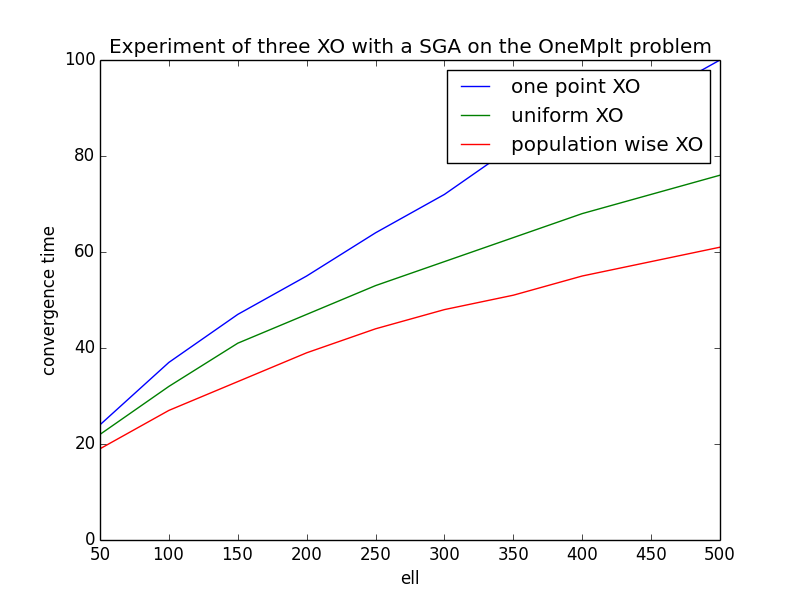
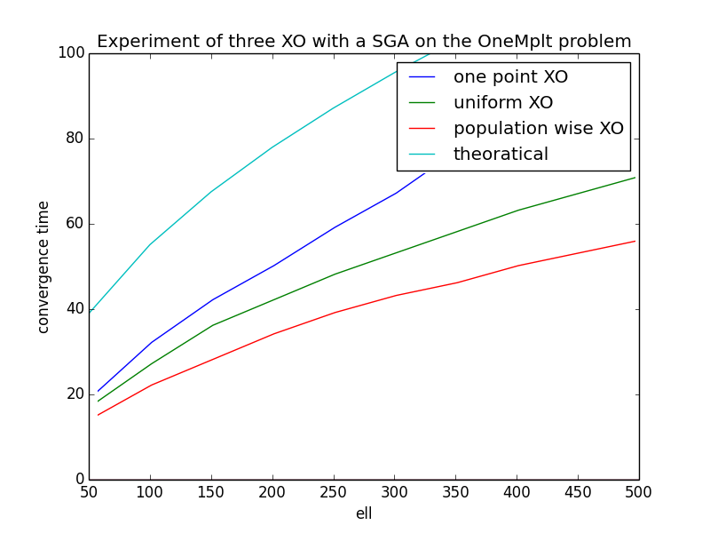
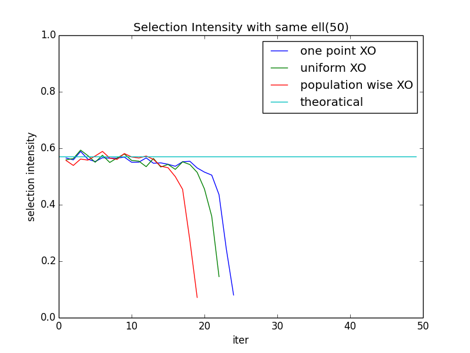
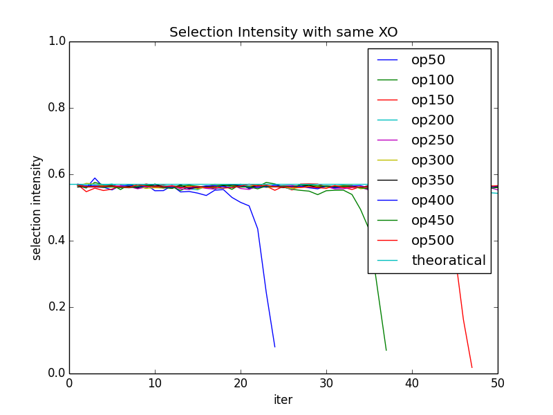

##Genetic Algorithms Assignment #1     
	ID:r07921076 Name:張晏誠 Instructor: Tian-Li Yu

1. (a) It could not happen. Assume $$f(00)$$ is the greatest, the deception occur 	**iff** $$ f(1*)>f(0*) ; f(*1)>f(*0) $$, it means: 

	$$
	\begin{cases}
	  f(11) + f(10) > f(01) + f(00) & (1)  \\
	  f(11) + f(01) > f(10) + f(00) & (2)  
	\end{cases}
	$$

	when $$(1) + (2)$$, the $$f(11)>f(00)$$, but the $$f(00)$$ is the greatest, contridiction.      

	(b) Probability of 3-deception is 0.00571. The [code](https://github.com/timtimchang/GA) was implemented by python 2.7.
	
	(c) Probability of 4-deception is 0.00026. The [code](https://github.com/timtimchang/GA) was implemented by python 2.7.
	
	(d) The porbability of 3-deception is 0.5, x $$\approx$$ 10; the porbability of 4-deception is 0.5, x $$\approx$$ 18; when probability of 3-deception is bigger than 4-decpetion, $$ (1 - 0.0057)^{ \textrm{C}_{3}^{ell} } < (1 - 0.00026)^{ \textrm{C}_{4}^{ell} } $$. The statement holds when $$ell = 91, 92, 93 $$. I think this range is too specific, and we might not meet this specific problem size.
	 
		
2. (a) The [code](https://github.com/timtimchang/GA) was implemented by python 2.7.     
	

  		
	

	
	(b) The theoretical value of selection intensity is about 0.57; the selection intensity could be more unstable respect to the theoretical value, especially at the end of the iteration. The figure below is the convergence time of the theroatical value and the three XO.
	
	

  		
	

	
	Below is the selection intensity of the theroatical value and the three XO when $$ell = 50 $$.
	
	

  		
	

	
	Below is the selection intensity of theroatical value and the one-point XO in differnt $$ell$$.
	
	

  		
	

	
	(c) The Thierens’ model assume perfect mixing, and it has the slowest convergence time. The selection intensity is also not as invariant as theoratical, it temped to be an more exaggerate value, especially at the end of the iteration. And the selection itensity is not sensitive to the population size, if we ignore the exaggerate ones.
	

	